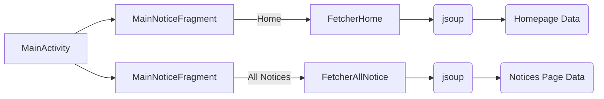
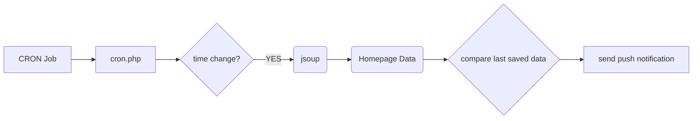

# NIT Agartala Notifications Android App

The app is [available on Play Store](https://play.google.com/store/apps/details?id=org.nita.notifications&hl=en_IN&gl=US)

# App Features

 - See all notices at one glance under a minimal beautiful interface.  
 - Once cached, notice titles can be read even if device is offline.  
 - Get notified via push notification when new notices are updated.  

## Advantages

The app does not run in the background or consume any resources. The website changes are checked centrally on a Google Cloud AppEngine Job every 2 hours from 7am to 10pm. If new contents are found on the website, push notifications are delivered to all users.  

## Developer Information

### Structure (Android App)

### Structure (App Engine Backend)

### Compilation Instructions

#### Android App

First let's get the Android app compiled and running.

- Set up Android SDK and Android Studio as well.
- You need `google-services.json` file to link with your own firebase project. Follow the steps in [Android Firebase Setup](https://firebase.google.com/docs/android/setup)
- This allows the app to register with Firebase push notifications. 
> The debug variant of build is slightly different from release variant. Apart from differentiation in name and package, debug variant subscribes to push notification topic **test** whereas release version subscribes to push notification topic **release**. This is intentionally done to prevent accidentally spamming normal users during testing.

#### Backend Pre Requisites

Now that the app is running, we would like to have the backend working so that push notifications can start working.

- The code for app engine is entirely under folder `nita_app_engine`
- Before we deploy the app, below pre-requisites need to be handled.
- Install PHP on your system for local testing purposes.
- Install the [Google Cloud SDK CLI](https://cloud.google.com/sdk/docs/install) to deploy the app later.
- Set up the same Firebase Project we created for Android App on GCP [App Engine](https://console.cloud.google.com/appengine)
- Make sure to enable [Cloud Storage Buckets](https://console.cloud.google.com/storage/browser) and [CRON Jobs](https://console.cloud.google.com/appengine/cronjobs) for the same project.

#### Backend Local Run
- Comment out the part marked in `cron.php` that uses cloud buckets and instead uncomment the part which uses local files. This is required to run locally.
- You need to put your [own firebase-sdk private key json](https://firebase.google.com/docs/admin/setup#initialize_the_sdk_in_non-google_environments) file for the app to be able to send push notifications to the project. Get your json file and put it in `secrets/something.json`. 
- You can start a server in `nita_app_engine` with command `php -S localhost:8080`and access `cron.php` page at `localhost:8080/tasks/cron` on your browser. This will execute the logic under cron job.
- If everything works, backend will update the files with new data. You can tinker with the existing data files to make it send push notification.

#### Backend App Engine Deploy
- Make sure you comment out/in the proper areas of `cron.php` again so that logic is using Cloud Storage instead of local files.
- Deploy the app using Gcloud CLI with command `gcloud app deploy`
- You can trigger a cron job from UI or wait till 2hrs, or whatever period of timing you've set. Also you can visit the `tasks/cron.php` endpoint on cloud to trigger the run.

> Please note that some of the services might need you to enable billing. Please take care not to run into huge unwanted costs due to oversight. Google makes it quite difficult to track the usages for beginners. Please do your due diligence while using GCP. The project here can run on free tier as usage and resource consumption is minimum. But there might be charges amounting to ₹5 to ₹10 while using Cloud Build during deploy. This is a bug with GCP  [mentioned here](https://stackoverflow.com/questions/62582129/multi-region-cloud-storage-charges#comment110963735_62584941)

> Please make sure you secure your endpoints and sensitive API keys so that they are not misused. Please follow the GCP security recommendations and do your due diligence while working with cloud.

### Disclaimer  

-  Information on this app comes from the [NIT Agartala Website](https://nita.ac.in).  
- This app does not represent any government or political entity.  
- The app is not affiliated to NIT Agartala.

