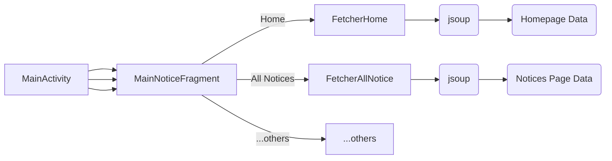
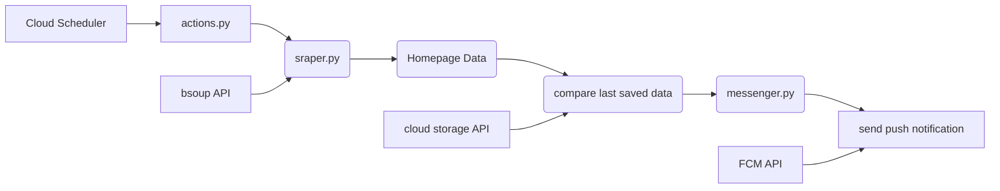

NIT Agartala Notifications Android App
=======================================

# App Features

 - See all notices at one glance under a minimal beautiful interface.  
 - Once cached, notice titles can be read even if device is offline.  
 - Get notified via push notification when new notices are updated.  

## Advantages

The app does not run in the background or consume any resources. The website changes are checked centrally through Google Cloud every 2 hours from 7am to 11pm. If new contents are found on the website, push notifications are delivered to all users.  

## Developer Information

### Structure (Android App)

### Structure (Cloud Function Backend)

### Compilation Instructions

#### Android App

First let's get the Android app compiled and running.

- Set up Android SDK and Android Studio as well.
- You need `google-services.json` file to link with your own firebase project. Follow the steps in [Android Firebase Setup](https://firebase.google.com/docs/android/setup)
- This allows the app to register with Firebase push notifications. 
> The debug variant of build is slightly different from release variant. Apart from differentiation in name and package, debug variant subscribes to push notification topic **test** whereas release version subscribes to push notification topic **release**. This is intentionally done to prevent accidentally spamming normal users during testing.

#### Backend Pre Requisites

Now that the app is running, we would like to have the backend working so that push notifications can start working.

- The code for cloud function is entirely under folder `nita_cloud_function`
- Before we deploy the function, below pre-requisites need to be handled.
- Install Python on your system for local testing purposes.
- Install the [Google Cloud SDK CLI](https://cloud.google.com/sdk/docs/install) to deploy the app later.
- Set up the [Cloud Function](https://console.cloud.google.com/functions) on GCP for the same app that we used to create the Firebase Setup earlier.
- Make sure to enable [Cloud Function](https://console.cloud.google.com/functions), [Cloud Run](https://console.cloud.google.com/run) and [Cloud Scheduler](https://console.cloud.google.com/cloudscheduler)  for the same project. 

#### Backend Local Run
- Run `main_web.py` on your system. It will expose endpoints on localhost.
- You need to put your [own firebase-sdk private key json](https://firebase.google.com/docs/admin/setup#initialize_the_sdk_in_non-google_environments) file for the app to be able to send push notifications to the project. Get your json file and put it in `secrets/something.json`.
- If everything works, backend will update the files with new data. You can tinker with the existing data files to make it send push notification.

#### Backend App Engine Deploy
- Check the file `nita_cloud_function/set_project_properties.sh` and replace your project id. You can get the project id from GCP UI.
- Deploy the app with command `sh deploy.sh`
- Create the cloud scheduler job using command `sh schedule.sh`
- You can trigger a cron job from Cloud Scheduler UI or wait till 2hrs, or whatever period of timing you've set.
- To maintain risks to minimum, default deployment does not expose endpoints publicly. You could tinker with the values in `deploy.sh` if you feel so.

> Please note that some of the services might need you to enable billing. Please take care not to run into huge unwanted costs due to oversight. Google makes it quite difficult to track the usages for beginners. Please do your due diligence while using GCP. If you are running Cloud Functions version of the project, it can run on free tier as usage and resource consumption is minimum.

> If you are using older and discontinued App Engine version of this project, there might be charges amounting to ₹5 to ₹10 while using Cloud Build during deploy. This is a bug with GCP App Engine [mentioned here](https://stackoverflow.com/questions/62582129/multi-region-cloud-storage-charges#comment110963735_62584941). I had also written a [blog post on this](https://amiaudible.medium.com/google-cloud-app-engine-forced-charges-8b2efc06f137?source=friends_link&sk=5d32a73fa6067a31256f920b2807d936)

> Please make sure you secure your endpoints and sensitive API keys so that they are not misused. Please follow the GCP security recommendations and do your due diligence while working with public cloud.

### Disclaimer  

- Information on this app comes from the [NIT Agartala Website](https://nita.ac.in).  
- This app does not represent any government or political entity.  
- The app is not affiliated to NIT Agartala.

